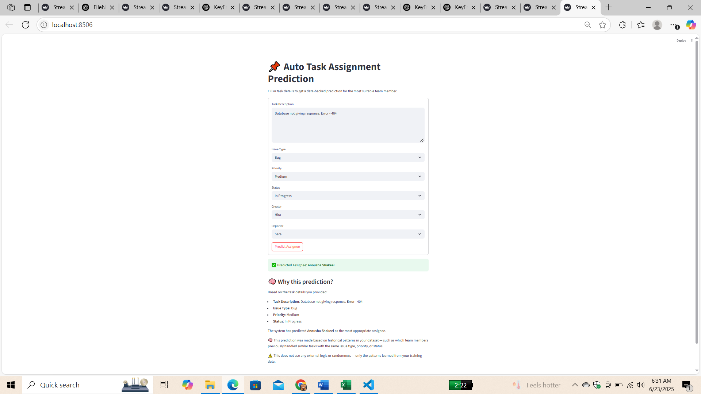

# 🧠 Auto Task Assignment using NLP & Deep Learning

An AI-powered task assignment system that automates task allocation using Natural Language Processing, Deep Learning, and Large Language Models (LLMs). Integrated with Jira and built with an interactive Streamlit interface, the system intelligently assigns tasks to the most suitable team member — and explains **why** each task was assigned.

---

## 🚀 Features

- 🔍 **NLP-based Task Understanding** using TF-IDF vectorization.
- 🧠 **Feedforward Neural Network** achieving **90% assignment accuracy**.
- ⚡ **Real-time Streamlit UI** for input and decision visualization.
- 🔗 **Jira Integration** for seamless task syncing and management.
- 🤖 **LLM-Powered Explainability**: Explains why a task was assigned to a specific individual.
- ✅ Dynamic input fields for task properties like `priority`, `status`, and `description`.

---

## 🛠️ Tech Stack

| Technology     | Usage                             |
|----------------|-----------------------------------|
| Python         | Core language                     |
| Scikit-learn   | TF-IDF vectorization              |
| Keras | Feedforward neural network                 |
| Streamlit      | Interactive UI                    |
| Jira API       | Task management integration       |
| OpenAI / LLMs  | Explainability of task assignment |

---

## 📊 Model Architecture

- **Vectorization**: TF-IDF to convert task descriptions into numerical features.
- **Model**: Feedforward Neural Network with hidden layers for classification.
- **Output**: Predicts the best assignee based on input features.
- **Accuracy**: Achieved **90%** accuracy on internal test data.

---

## 🧪 How It Works

1. User enters task info (e.g., description, priority, status) via Streamlit UI.
2. The model processes the input and predicts the most suitable team member.
3. A connected LLM module explains *why* the task was assigned to that individual.
4. The task is automatically assigned in **Jira** via API.

---

## 📷 Screenshots

